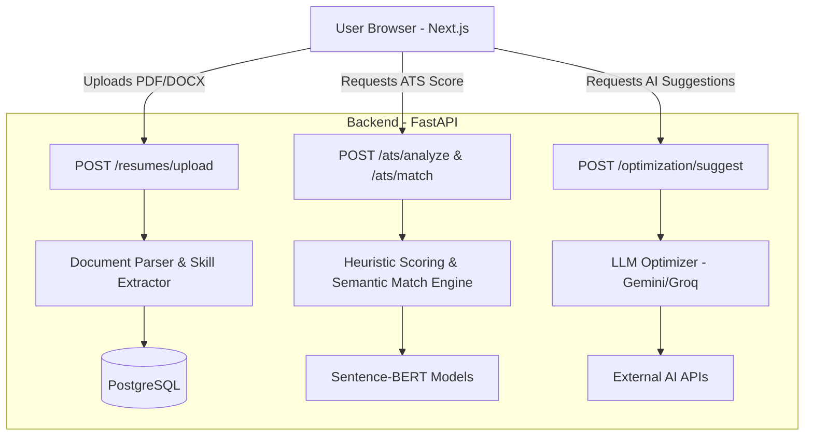
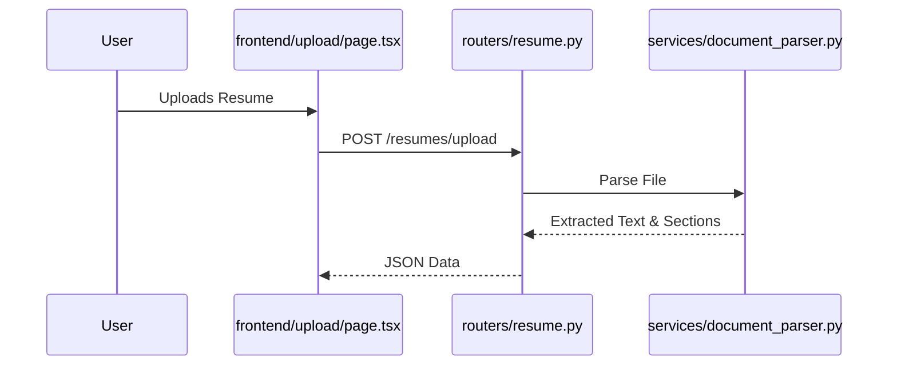
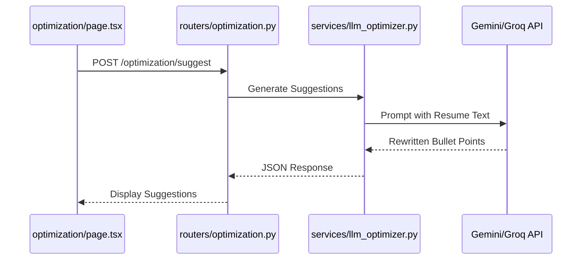

# Application Architecture & Flow Explanation (ResumeIQ / Career Copilot)

This document provides a comprehensive end-to-end explanation of how the application works, how the files are connected, and the overall system flow.

## 1. High-Level Architecture Overview

The system follows a modern decoupled architecture:
- **Frontend**: Next.js (React) application for user interaction, file uploads, and displaying interactive dashboards and suggestions.
- **Backend**: FastAPI (Python) application handling heavy processing, PDF parsing, NLP tasks (Sentence-BERT), heuristic scoring, and LLM orchestration (Gemini/Groq).
- **Database**: PostgreSQL (with pgvector) for storing parsed resumes and user profiles, along with Redis for optional caching (handled via docker-compose).

### High-Level Flow Diagram

## 2. Step-by-Step User Flow & File Connections

The user's journey can be broken down into four distinct phases. Below is the mapping of how the frontend requests propagate through the backend files.

### Phase 1: Uploading the Resume
**Starting Point:** The user navigates to the upload page in the frontend.

1. **Frontend**: `frontend/src/app/upload/page.tsx`
   - Provides a drag-and-drop interface.
   - Converts the uploaded file (PDF/DOCX) to FormData and sends a `POST` request to `/resumes/upload`.
2. **Backend Router**: `backend/app/routers/resume.py`
   - Receives the file and initiates the parsing process.
3. **Backend Services**: 
   - `backend/app/services/document_parser.py`: Extracts raw text from the PDF/DOCX using PyMuPDF.
   - `backend/app/services/parser.py` & `experience_parser.py`: Uses Regex and rule-based logic to extract sections like Education, Experience, and Skills.
   - `backend/app/services/skill_extractor.py`: Extracts technical and soft skills.
4. **End Result**: The backend returns a structured JSON of the parsed resume to the frontend.

### Phase 2: ATS Scoring (Resume Only)
**Starting Point:** After upload, the frontend requests an ATS score.

1. **Backend Router**: `backend/app/routers/ats.py` (`POST /ats/analyze`)
2. **Backend Services**:
   - `backend/app/services/scoring_engine.py`: Analyzes the extracted sections and assigns a score (0-100) based on heuristic rules:
     - **Structure**: Are standard sections present?
     - **Skills**: Are there enough technical skills listed?
     - **Experience**: Are bullet points formatted well?
     - **Impact**: Are metrics (%, $, numbers) used in bullet points?
3. **End Result**: Returns a breakdown of scores and specific lagging fields.

### Phase 3: Job Description Matching (Optional)
**Starting Point:** The user pastes a Job Description to see how well their resume matches.

1. **Backend Router**: `backend/app/routers/ats.py` (`POST /ats/match`)
2. **Backend Services**:
   - `backend/app/services/jd_parser.py` & `jd_analyzer.py`: Parses the raw job description to extract required skills and experience.
   - `backend/app/services/match_engine.py`: Uses fuzzy string matching (RapidFuzz) to find exact keyword matches.
   - `backend/app/services/semantic_engine.py`: Uses `Sentence-BERT` (`all-MiniLM-L6-v2`) to perform semantic similarity matching. This understands that "Software Engineer" matches "Backend Developer" contextually.
   - `backend/app/services/jd_scoring_engine.py`: Aggregates the fuzzy and semantic matches into a final "Job Match Score".

### Phase 4: AI Optimization & Rewriting
**Starting Point:** The user asks for actionable advice to improve their resume.

1. **Frontend**: `frontend/src/app/optimization/page.tsx`
   - Displays the ATS score and allows the user to request AI suggestions.
2. **Backend Router**: `backend/app/routers/optimization.py` & `backend/app/routers/intelligence.py`
3. **Backend Services**:
   - `backend/app/services/llm_optimizer.py`: Prepares a strict prompt enforcing "no hallucination" rules, and calls the Google Gemini or Groq API (based on `backend/app/config.py`). It asks the LLM to rewrite bullet points using the STAR method based *only* on the provided facts.
   - `backend/app/services/evidence_optimizer.py`: Cross-references the LLM's output to ensure no fake metrics were added, providing a safeguard against AI hallucinations.
4. **End Result**: The frontend receives JSON containing rewritten professional summaries and experience bullet points, which are presented to the user to copy/paste.

## 3. Comprehensive File Reference Guide

### Backend (`/backend/app/`)

**Core Configuration:**
| File | Purpose |
|------|---------|
| `main.py` | FastAPI entry point. Mounts the routers, configures CORS for Next.js, and initializes the DB tables. |
| `config.py` | Uses Pydantic `BaseSettings` to load `.env` variables securely (e.g., API Keys, Database URLs, Models). |
| `database.py` | Sets up the SQLAlchemy database engine and session maker for PostgreSQL. |
| `models.py` | Defines the SQLAlchemy ORM models (tables) for users, resumes, and saved analysis results. |

**Routers (`/backend/app/routers/`):**
*These files define the API endpoints and act as traffic controllers.*
| File | Purpose |
|------|---------|
| `resume.py` | Handles `POST /resumes/upload`. Validates the file, calls parsing services, and returns parsed JSON. |
| `ats.py` | Handles `POST /ats/analyze` and `POST /ats/match`. Triggers the heuristic scoring and Job Description matching engines. |
| `optimization.py` | Handles `POST /optimization/suggest`. Routes requests to the AI engine for resume rewriting. |
| `intelligence.py` | Handles advanced AI-driven diagnostics (e.g., explainable feedback on why a score is low). |

**Services (`/backend/app/services/`):**
*This is the "Brain" of the application where all heavy lifting occurs.*
| File | Purpose |
|------|---------|
| `document_parser.py` | Extracts raw, unstructured text from uploaded PDF and DOCX files using `PyMuPDF`. |
| `parser.py` | Uses Regex rules to slice the raw text into logical sections (Education, Experience, Projects). |
| `experience_parser.py` | Specifically breaks down the "Experience" section into individual roles and bullet points. |
| `skill_extractor.py` | Analyzes text to find matching hard skills, soft skills, and tools. |
| `scoring_engine.py` | Runs heuristic algorithms (rule-based) to score the resume from 0-100 on structure, impact, and keywords. |
| `match_engine.py` | Uses `RapidFuzz` to perform fuzzy string matching between the resume and Job Description keywords. |
| `semantic_engine.py` | Loads the `Sentence-BERT` model (`all-MiniLM-L6-v2`) to compare the contextual meaning of resume bullets vs job requirements. |
| `jd_parser.py` | Parses and cleans up raw Job Description text. |
| `jd_analyzer.py` | Analyzes the Job Description to extract the required skills and seniority level. |
| `jd_scoring_engine.py` | Aggregates fuzzy match scores and semantic match scores to output a final "Hybrid Match Score". |
| `llm_optimizer.py` | Prepares strict, zero-hallucination prompts and manages the API calls to Google Gemini or Groq. Features an in-memory cache to save API costs. |
| `evidence_optimizer.py` | Acts as a guardrail. After the LLM rewrites a bullet, this service checks if the LLM hallucinated any metrics not present in the original text. |

### Frontend (`/frontend/src/app/`)
| File/Directory | Purpose |
|----------------|---------|
| `layout.tsx` | Global Next.js wrapper containing the Navbar, Footer, and font definitions. |
| `page.tsx` | The landing page of the platform, introducing the tool. |
| `globals.css` | Tailwind CSS configuration and custom global styles. |
| `upload/page.tsx` | The file upload interface. Handles drag-and-drop, loading states, and HTTP POST to `/resumes/upload`. |
| `dashboard/page.tsx` | The analytics dashboard. Displays the parsed resume structure, ATS scores, and visual charts. |
| `optimization/page.tsx` | The AI editor UI. Displays the LLM's suggested rewrites side-by-side with original text, allowing users to copy the improved bullet points. |

## 4. End-to-End Execution Trace

Here is the exact, step-by-step sequence of events that occurs when a user interacts with the platform:

### Step 1: Initializing the System
1. **Developer Action**: Copies `.env.example` to `.env` and fills in API keys for Gemini/Groq.
2. **Backend Startup**: Runs `uvicorn app.main:app`. `main.py` is executed.
3. **Database Initialization**: `models.Base.metadata.create_all` creates Postgres tables if they don't exist.
4. **NLP Model Loading**: On the first request to `semantic_engine.py`, the `Sentence-BERT` model is downloaded from HuggingFace to the local machine.
5. **Frontend Startup**: Runs `npm run dev`. The Next.js server boots and serves `page.tsx`.

### Step 2: The Upload & Parsing Pipeline
1. **User Action**: Drags a PDF resume into `frontend/src/app/upload/page.tsx`.
2. **Frontend Network Request**: The React component sends a `multipart/form-data` POST request to `http://localhost:8000/resumes/upload`.
3. **Backend Routing**: `backend/app/routers/resume.py` receives the file bytes.
4. **Text Extraction**: The router passes the bytes to `services/document_parser.py`, which uses PyMuPDF to extract a single large string of text.
5. **Section Parsing**: The raw string is passed to `services/parser.py`, which uses Regex to find headings ("Work Experience", "Education") and splits the string into a dictionary.
6. **Granular Extraction**: `services/experience_parser.py` further splits the experience text into companies, dates, and arrays of bullet points.
7. **Skill Extraction**: `services/skill_extractor.py` scans the text and outputs a list of matched skills.
8. **Response**: The router wraps all this extracted data into a JSON response and sends it back to the frontend.
9. **UI Update**: The frontend redirects the user to `/dashboard` with the parsed JSON data saved in state.

### Step 3: The Scoring Pipeline
1. **User Action**: The `/dashboard` page automatically requests a score for the newly parsed resume.
2. **Frontend Network Request**: Sends `POST /ats/analyze` with the parsed resume JSON.
3. **Backend Routing**: `backend/app/routers/ats.py` receives the data.
4. **Heuristic Scoring**: The router calls `services/scoring_engine.py`.
5. **Rule Evaluation**: The engine iterates through rules (e.g., "Are there at least 10 skills?", "Do the bullet points contain numbers/percentages?").
6. **Response**: A JSON object containing the total score out of 100 and a list of lagging dimensions is returned.
7. **UI Update**: The Next.js dashboard renders circular progress bars and feedback cards.

### Step 4: The AI Optimization Pipeline
1. **User Action**: The user navigates to `/optimization` and clicks "Suggest Improvements".
2. **Frontend Network Request**: Sends `POST /optimization/suggest` containing the original resume text.
3. **Backend Routing**: `backend/app/routers/optimization.py` intercepts the request.
4. **LLM Orchestration**: The router calls `services/llm_optimizer.py`.
5. **Prompt Engineering**: The optimizer constructs a massive string containing the user's resume, the strict "Do not hallucinate" system prompt, and the requested JSON schema.
6. **External API Call**: The optimizer checks `config.py` for the preferred provider (`gemini` or `groq`), authenticates, and sends the prompt over the internet.
7. **Hallucination Check**: The response from the LLM is intercepted by `services/evidence_optimizer.py` to ensure the AI didn't invent a metric (like changing "increased sales" to "increased sales by 500%").
8. **Response**: The verified JSON suggestions (rewritten bullet points, new professional summary) are sent back.
9. **UI Update**: The frontend displays a sleek side-by-side comparison where the user can copy the new, ATS-optimized bullet points directly into their document.
